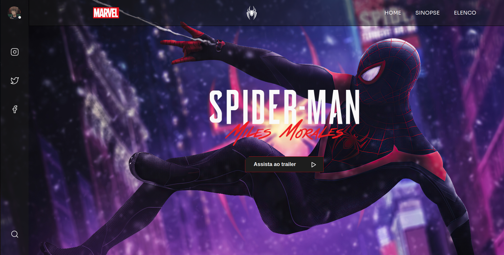

# Spider-Man: Miles Morales

Esse projeto foi desenvolvido com base em um design uma página dedicada ao grande Homem-aranha: Miles Morales, onde apresenta uma design muito bonito em sua homenagem. Ná página é possível ver funções interessantes, como a troca do botão de online/offline. Atualmente devido ao seu design original, a tela está disponível de forma responsiva para telas de notebook e desktop.  

**Tecnologias** usadas: HTML, CSS e Javascript.

**Screenshot** da página:  

**Link** da página: https://thiagothree.github.io/homem-aranha-miles-morales/

**Versão** atual: 1.0  
_Funcionalidades_ da versão 1.0:  
- Os links te levam as redes sociais do desenvolvedor.
- O icone de status pode ser alterado entre online (padrão) e o offline.  
 
**Versões** futuras irão chegam o mais rápido possível.